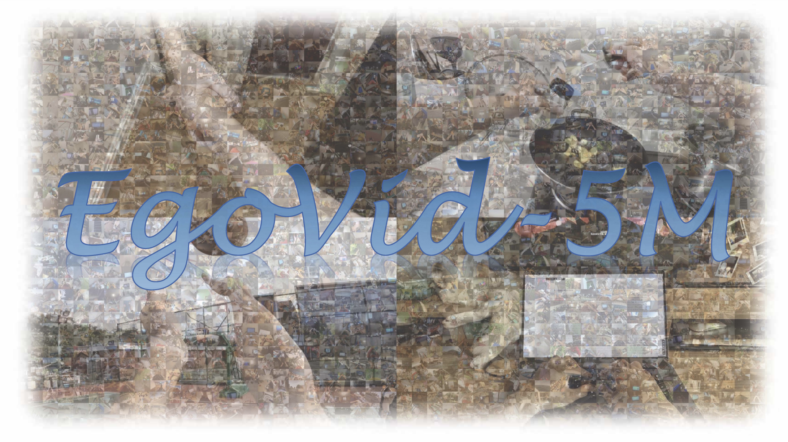
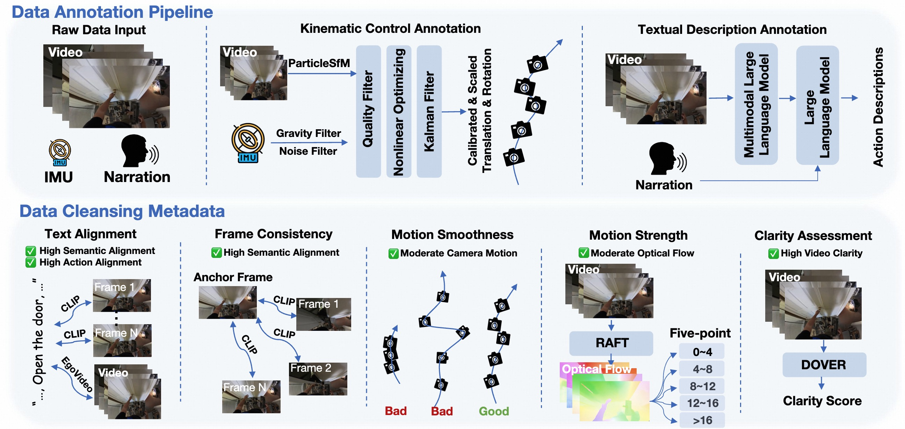

## [Project Page](https://egovid.github.io) | [Paper](https://arxiv.org/pdf/2411.08380) | [Meta Data](https://modelscope.cn/datasets/iic/EgoVid/)
## Dataset Description
EgoVid is a meticulously curated high-quality action-video dataset designed specifically for egocentric video generation. It encompasse 5 million egocentric video clips and includes detailed action annotations, such as fine-grained kinematic control and high-level text descriptions. Furthermore, it incorporates robust data cleansing strategies to ensure frame consistency, action coherence, and motion smoothness under egocentric conditions.



### Data Annotation and Cleaning
In order to simulate ego-view videos from egocentric actions, we construct detailed and accurate action annotations for each video segment, encompassing low-level kinematic control (e.g., ego-view translation and rotation), as well as high-level textual descriptions. Additionally, Considering the data quality significantly influences the effectiveness of training generative models. Prior works have delved into various cleansing strategies to improve video datasets, focusing on aesthetics, semantic coherence, and optical flow magnitude. Based on these cleaning strategies, this paper presents a specialized cleansing pipeline specifically designed for egocentric scenarios.


### Data Annotation Pipeline
1. High-level action annotation (caption)

- refer to [High-level action annotation](./processor/egovid-high-level-action(caption)/README.md)


2. Low-level action annotation (camera params)

- refer to [Low-level action annotation](./processor/egovid-low-level-action(cam_control)/README.md)


3. Metadata annotation (DOVER score, EgoVideo Score, CLIP score, Optical-flow score)

- refer to [Metadata annotation](./processor/egovid-metadata/README.md)


## Data Preparation

### Source Data Downloading
Please refer to the [Ego4D official set](https://ego4d-data.org/#download) to download the source videos. We only need the source videos, so you can skip other metadata, and you can specify video resolution during downloading (1080P: 7.1TB, 540P: 3.5TB). Notably, this repo only contains the action annotations (kinematic and text) and cleaning metadata.


### Data Structure
#### Source Ego4D Videos
```
Ego4D
├── v1/
├── v2/
│   ├── video/
│   │   ├── 0a02a1ed-a327-4753-b270-e95298984b96.mp4
│   │   ├── ...
│   ├── video_540ss/ (Optional)
│   │   ├── 0a02a1ed-a327-4753-b270-e95298984b96.mp4
│   │   ├── ...
```
#### CSV File Information
The key columns in the csv files are:
```
- video_id: VideoID_StartFrame_EndFrame, where VideoID is the filename of source video, StartFrame and EndFrame are the start and end frame index of the video clip.
- frame_num: number of frames
- fps: frames per second
- noun_cls: the Noun class of the action description.
- verb_cls: the Verb class of the action description.
- llava_cap: the detailed caption of the video clip (annotated by LLaVA-Video).
- name: the annotated high-level text action description (summarized by Qwen).
- flow_mean: the averaged optical flow magnitude of the video clip.
- flow_0_4: the ratio of optical flow magnitude within the range [0, 4].
- flow_4_8: the ratio of optical flow magnitude within the range [4, 8].
- flow_8_12: the ratio of optical flow magnitude within the range [8, 12].
- flow_12_16: the ratio of optical flow magnitude within the range [12, 16].
- flow_16_: the ratio of optical flow magnitude larger than 16.
- ti_sim: the CLIP similarity between 4 frames and the action description (split by ',').
- ii_sim: the CLIP similarity between the first frame and another 3 frames (split by ',').
- dover_score: the DOVER score of the video clip.
- egovideo_score: the EgoVid score of the video clip and the action description.
```

Below is the special columns in the egovid-kinematic.csv and egovid-val.csv. Note that there are [known issues](https://ego4d-data.org/docs/data/imu/) in the raw IMU data. Thus we recommend to use the pose annotations (poses.zip).
```
gyro_x: the imu gyroscope data, x-axis
gyro_y: the imu gyroscope data, y-axis
gyro_z: the imu gyroscope data, z-axis
accl_x: the imu accelerometer data, x-axis
accl_y: the imu accelerometer data, y-axis
accl_z: the imu accelerometer data, z-axis
```


#### Poses File
poses.zip contains the kinematic poses of the ego-view camera.
```
unzip poses.zip
```
The file structure is as follows:
```
poses
├── 0a47c74a-dad9-42d5-b937-0f375490f034_0_162/
│   ├── cost.txt (The cost of matching ParticleSfM poses and IMU poses, the lower the better)
│   ├── intri.npy (Camera intrinsics with shape [3, 3], which is calculated based on the 540 resolution)
│   ├── sfm_pose.npy (Camera extrinsics calculated by ParticleSfM (already scaled), shape [120(Frame num), 4, 4])
│   ├── imu_pose.npy (Camera extrinsics calculated by IMU (already transformed to the camera coordinate))
│   ├── fused_pose.npy (Camera extrinsics calculated by Kalman Filter (recommended))
├── 0a47c74a-dad9-42d5-b937-0f375490f034_2730_2892/
│   ├── ...
```
## Acknowledgement

Many thanks to these excellent projects:
- [Ego4D](https://ego4d-data.org/)
- [VBench](https://vchitect.github.io/VBench-project/)
- [EgoVideo](https://github.com/OpenGVLab/EgoVideo)
- [DOVER](https://github.com/VQAssessment/DOVER)
- [Qwen](https://huggingface.co/Qwen)
- [RAFT](https://github.com/princeton-vl/RAFT)
- [LLaVA-Video](https://huggingface.co/collections/lmms-lab/llava-video-661e86f5e8dabc3ff793c944)
- [ParticleSfM](https://github.com/bytedance/particle-sfm)


## Bibtex
If this work is helpful for your research, please consider citing the following BibTeX entry.

```
@article{wang2024egovid,
  title={EgoVid-5M: A Large-Scale Video-Action Dataset for Egocentric Video Generation},
  author={Wang, Xiaofeng and Zhao, Kang and Liu, Feng and Wang, Jiayu and Zhao, Guosheng and Bao, Xiaoyi and Zhu, Zheng and Zhang, Yingya and Wang, Xingang},
  journal={arXiv preprint arXiv:2411.08380},
  year={2024}
}
```

